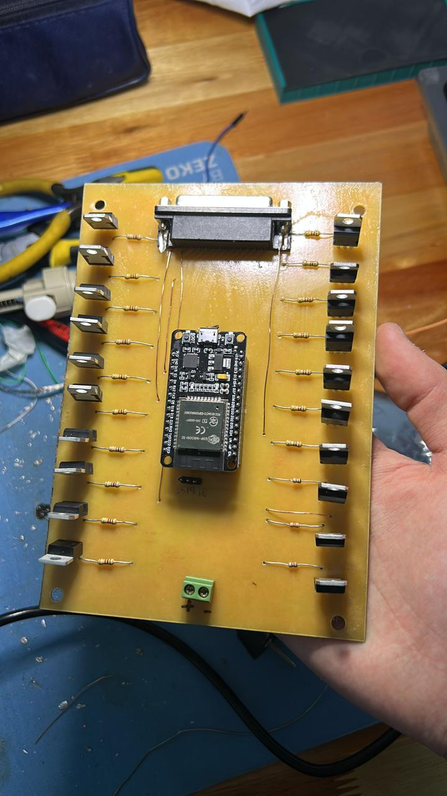

# Cartel LED inteligente Proyecto Final 2025
###

  <!-- Imagen 1 grande arriba -->
 

  <!-- Imagen 1 grande arriba -->
  

    
  

  <!-- Imagen 2 debajo de la 1, rotada 90 grados -->
  

    
  

  <!-- Imágenes 3 y 4 abajo, una al lado de la otra -->
  

    
    
  

###
## 
- Proyecto: cartel LED multiplexado controlado por ESP32, columnas por 3×74HC595 (24 cols), filas por transistores TIP122.
(POR CADA MODULO).

- EL CARTEL FINAL SERA DE 20 FILAS x 96 COLUMNAS (4 MODULOS EN CONECTADOS HORIZONTALMENTE).

- RESULTARA CON UNAS DIMENSIONES DE 1.7m x 40cm.

# Resumen

Este repositorio contiene el firmware para un cartel LED multiplexado con ESP32. Usa 3 registros 74HC595 en cascada para controlar 24 columnas y 18 pines del ESP32 (a través de transistores TIP122 o drivers) para seleccionar filas. El microcontrolador corre un servidor web simple que permite enviar el texto que se desplaza horizontalmente (scroll), elegir dirección y velocidad y persiste la configuración en flash con `Preferences`.

----------

# Características

-   Matriz: `MATRIX_ROWS = 18`, `MATRIX_COLS = 24` (configurable).
    
-   Control de columnas por 3×`74HC595` en cascada.
    
-   Control de filas por pines del ESP32 (transistores TIP122 u otro driver).
    
-   Framebuffer en RAM: `framebuffer[MATRIX_ROWS][BYTES_PER_ROW]`.
    
-   Librería gráfica `Adafruit_GFX` + fuente compilada.
    
-   Interfaz web responsive para editar el mensaje, ver demo y ajustar velocidad/dirección.
    
-   Persistencia con `Preferences` (mensaje, velocidad, dirección).
    
-   mDNS disponible: `cartelhuergo.local` (si mDNS funciona en tu red).
    

----------

# Diagrama y conexionado (detalle)

> **Nota importante:** el ejemplo asume columnas manejadas por 74HC595 como _fuente_ (HIGH = +V para anodos) y filas controladas por NPN (TIP122) que _conectan a GND_ (sink) cuando activadas. Esta es la configuración que coincide con el comportamiento del código (`sr.set(b, HIGH)` y `digitalWrite(filas[f], HIGH)` para activar fila).

### Conexiones básicas

Señales principales (ESP32 ↔ 74HC595)

- DATA_PIN (23) -> Serial Data (DS / SER) del primer 74HC595

- CLOCK_PIN (18) -> Shift clock (SH_CP)

- LATCH_PIN (19) -> Store clock / latch (ST_CP)

### Salidas 74HC595 -> columnas

-   Q0..Q7 (primer registro) -> columnas 0..7
    
-   Q0..Q7 (segundo registro) -> columnas 8..15
    
-   Q0..Q7 (tercer registro) -> columnas 16..23
    

Asegurate del orden físico: la librería / código usa `sr.set(b, value)` con `b` de 0 a 23. Si tus registros están conectados en distinto orden, reordena o ajusta mapping.

### Filas (por TIP122)

Cada fila física (catodo común en el esquema) va a un TIP122 que tiene:

-   Colector -> pin fila (panel LED)
    
-   Emisor -> GND
    
-   Base -> pin ESP32 a través de resistencia de 1k  
    En el código `digitalWrite(filas[f], HIGH)` activa la fila (enciende transistor, conecta a GND).
    

### Alimentación

-   **Fuente**: calcula la corriente por LED (Iled) × cantidad máxima encendida simultáneamente. En multiplexado de filas, una sola fila se enciende a la vez, por lo que la corriente máxima es (#LEDsPorFila × Iled). Ejemplo: 24 LEDs por fila × 20 mA = 480 mA por fila (añadir margen). Para 18 filas multiplexadas no sumes todas; la fuente debe poder suministrar el pico por fila y la electrónica.
    
-   **Voltage registers**: 74HC595 soporta Vcc 2–6V; si usas LED de 5V considera 5V lógica o usar nivel shifters. Con ESP32 (3.3V) se suele usar 5V para LEDs y la salida del 74HC595 a 5V está OK si los 74HC595 toleran 3.3V en entradas. Revisa datasheets o usa versiones 74HCT (más compatible con 3.3V).
    
-   GND común obligatorio.
    

----------

# Cómo funciona (conceptos clave)

1.  **Framebuffer**: `uint8_t framebuffer[MATRIX_ROWS][BYTES_PER_ROW];`
    
    -   Cada fila tiene `BYTES_PER_ROW` bytes (3) → 24 columnas → 24 bits por fila.
        
    -   El bit más significativo (0x80) corresponde a la columna `x % 8 == 0` por el cálculo `0x80 >> (x % 8)`.
        
2.  **Dibujo**: Heredas `Adafruit_GFX` con `MatrixDisplay` y sobreescribes `drawPixel(x,y,color)`. Cuando se escribe texto con `display.print(curMessage)` Adafruit_GFX setea pixels en el framebuffer.
    
3.  **Multiplexado**:
    
    -   `refrescarMatrizCompleta()` recorre filas `f = 0..MATRIX_ROWS-1`.
        
    -   Para cada fila: apaga fila previa, envía todos los 24 bits (columnas) al `74HC595` con `sr.set(b, ...)`, activa la fila actual (`prenderFila(f)`), espera `delayMicroseconds(100)` y la apaga.
        
    -   Los LEDs que deben estar on durante esa fila se encienden porque sus columnas están `HIGH` (desde el 74HC595) y la fila está siendo _sink_ por el TIP122.
        
4.  **Scroll**:
    
    -   `xPos` controla la posición horizontal; cada `scrollSpeed` ms el texto avanza `±1`.
        
    -   `display.getTextBounds()` calcula anchura `w` del texto para resetear `xPos`.
        
5.  **Web**:
    
    -   Un web server simple en puerto 80 sirve `WebPage` y procesa parámetros en URL `?MSG=...&SD=L|R&SP=xxx`.
        
    -   El código parsea URL en `getData()` decodificando `%xx`.
        
6.  **Persistencia**:
    
    -   `Preferences` guarda `mensaje`, `speed`, `dir` para restaurar tras reset.
        

----------

## Explicación técnica: ¿qué es y cómo funciona un TIP122?

**TIP122 — resumen práctico**

-   El TIP122 es un transistor Darlington NPN empaquetado (dos transistores en cascada dentro de un solo encapsulado).
    
-   Ventaja: **ganancia de corriente muy alta** (β muy grande), por eso con poca corriente de base podés conmutar corrientes relativamente altas en el colector.
    
-   Desventaja: **alta caída de saturación** (VCE(sat) típicamente ~1.5–2.5 V dependiendo de corriente), lo que produce **pérdida de potencia** y calor. Además la caída base-emisor de la entrada es mayor (~2.5–3V total, por las dos uniones).
    

**Cómo se usa en el cartel**

-   Usamos TIP122 como _sink_ por fila: cuando su base recibe HIGH, el transistor conecta la fila a GND permitiendo que los LEDs de esa fila con columna HIGH se iluminen.
    
-   Colocá **una resistencia en la base** entre ESP32 y la base del TIP122 (ej. 1kΩ es una buena práctica). Esto limita la corriente desde el pin del ESP32.
    

**Cálculos y precauciones**

-   Si `I_collector = 480 mA` y `VCEsat ≈ 2 V` → potencia en el transistor `P = VCEsat × I = 2 V × 0.48 A = 0.96 W`. Esto **genera calor** y normalmente requiere disipador.
    
-   Con ESP32 (GPIO a 3.3 V) la base del TIP122 queda con poca tensión sobre la resistencia (Vbase ≈ 2.5 V), por eso la corriente de base es pequeña — aun así la ganancia Darlington suele permitir conmutar la corriente del colector.
    
-   **Recomendación:** para menor pérdida térmica y menor VCE(sat) usar un **MOSFET N-channel lógico (logic-level)** como alternativa — mucho menor VDS(on) y menos calor. Ej: si conseguís un MOSFET de canal N con Rds(on) bajo y que se active con 3.3 V (IRLZ44N no siempre es la mejor opción, buscá específicamente “logic-level MOSFET”), vas a reducir pérdidas térmicas.
    

**Valores orientativos**

-   Resistencia base típica: `1kΩ` (puede ajustarse entre 470Ω y 4.7kΩ según diseño).
    
-   Verifica disipación térmica y agrega disipador o cambialo por MOSFET si vas a manejar corrientes grandes.
    

----------

## Explicación técnica: ¿qué es y cómo funciona un 74HC595?

**74HC595 — resumen práctico**

-   Es un _registro de desplazamiento (shift register)_ con latch y 8 salidas paralelas (Q0..Q7).
    
-   Funcionalmente tiene dos registros internos:
    
    -   **Shift register**: donde se van desplazando los bits con cada pulso de reloj (SH_CP).
        
    -   **Storage register** (o latch register): se actualiza cuando se pulsea ST_CP (latch). De este modo podés enviar muchos bits sin que las salidas cambien hasta que hagas latch.
        
-   Señales principales:
    
    -   `SER` (DS): serial data in
        
    -   `SH_CP` (clock): desplaza un bit en el shift register al flanco activo
        
    -   `ST_CP` (latch): copia el contenido del shift register al storage register → las salidas cambian
        
    -   `Q0..Q7`: salidas paralelas
        
    -   `Q7'` (o Q7S/Q7') suele ser serial out para encadenar el siguiente 74HC595 (cascada)
        
    -   `OE` (Output Enable, activa low) y `MR` (Master Reset, activa low) controlan si las salidas están habilitadas o si el registro se resetea
        

**Por qué lo usamos**

-   Permite controlar **muchas columnas** con solo 3 pines del micro (data, clock, latch).
    
-   Con `Q7'` encadenás los registros y podés manejar 24 columnas en serie.
    

**Consejos de uso**

-   **Cargar todos los bits** (ej. 3 bytes) en el shift register con pulsos de clock y al final hacer un `latch` para actualizar las salidas en una operación atómica. Esto evita glitches.
    
-   `OE` lo podés usar para blanking rápido (si querés apagar todas las salidas momentáneamente).
    
-   `MR` te permite resetear las salidas (activo bajo).
    

**Limitaciones eléctricas importantes**

-   Los pines del 74HC595 no están pensados para conducir corrientes muy altas de forma sostenida. Aunque pueden entregar decenas de mA en condiciones cortas, **no es buena idea esperar 20–25 mA sostenidos por salida sin verificar la hoja de datos**.
    
-   En multiplexado, cada salida del 74HC595 típicamente solo alimenta un LED a la vez (por fila), lo que reduce la corriente sostenida por pin, pero **es crucial usar resistencias por LED** y mantener la corriente por pin dentro de límites razonables.
    
-   Para compatibilidad con **ESP32 (3.3 V)** se recomienda la versión **74HCT595** o comprobar que la lógica 74HC595 que uses interpreta 3.3 V como HIGH de forma fiable. `74HCT` suele aceptar 3.3 V como HIGH cuando la alimentación del chip es 5 V — aún así, revisar datasheets.
    

**Buenas prácticas**

-   Si necesitás más corriente o brillo, usar drivers especializados para LEDs (p. ej. registros con driver de corriente constante) o agregar transistores por columna si vas a exigir >10 mA por salida.
    
-   Si microcontrolador y 74HC595 comparten diferentes tensiones (3.3V vs 5V), considera conversión de niveles o usar 74HCT compatibles.

# Dependencias y preparación del entorno

-   **Placa:** ESP32 (seleccionar en Arduino IDE -> Board Manager).
    
-   **Librerías (instalar desde Library Manager / Git):**
    
    -   `ShiftRegister74HC595` (o la que uses; tu código ya referencia la plantilla `ShiftRegister74HC595<3>`).
        
    -   `Adafruit_GFX` (para la API gráfica).
        
    -   `ESPmDNS` (incluida con núcleo ESP32).
        
    -   `Preferences` (incluida).
        
    -   Fuente convertida a header: `LEMONMILK_Regular11pt7b` (como `Fonts/LEMONMILK_Regular11pt7b.h`). Para convertir TTF → Adafruit font: usar `truetype2gfx` o `fontconvert` (links en comentarios del código).
        
        > `https://rop.nl/truetype2gfx/ FONTS PAGE`
        

### Recomendaciones de configuración en Arduino IDE

-   Board: `ESP32 Dev Module` (o el modelo exacto)
    
-   Flash Frequency: 80 MHz
    
-   Upload Speed: 115200 o 921600 (según tu puerto)
    
-   Partition Scheme: default (si necesitas mucha NVS, ajustar)
  
    

----------

# Interfaz Web / API

-   Página principal (sirve `WebPage`) incluye demo y formulario.
    
-   **Enviar**: pulsa `Enviar` en la UI → hace `window.location='/?MSG='+msg+'&SD='+SD+'&SP='+SP`.
    
-   **Formato URL manual**:
    
    `http://<IP_DEL_ESP32>/?MSG=Tu%20mensaje%20aqui&SD=L&SP=100` 
    
    -   `MSG` = texto codificado en URL (máx 255 chars en tu buffer).
        
    -   `SD` = `L` (izquierda) o `R` (derecha).
        
    -   `SP` = velocidad (entero). En tu código `scrollSpeed` en ms.
        
-   **Demo**: la demo en el HTML hace scroll CSS/JS y usa fuente tipo LED (DotGothic16).
    

----------

# Configuraciones persistentes

-   Namespace `prefs.begin("cartel", false);`
    
-   Keys:
    
    -   `"mensaje"` (String)
        
    -   `"speed"` (uint)
        
    -   `"dir"` (bool)
        
-   Para resetear preferencias manualmente: puedes añadir un endpoint `/reset` que haga `prefs.clear()` o borrar desde código.
    

----------
